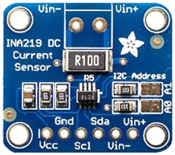

# pimatic-i2c 

Pimatic plugin for the I2C based sensors

This plugin makes I2C based sensors available in Pimatic. Devices are connected via the I2C port of your computer.
The plugin is tested on a raspberry pi.

The plugin can be installed via the plugins page of Pimatic.

## Config of the plugin
```
{
  debug: "Debug mode. Writes debug messages to the Pimatic log, if set to true."
}
```
After installation of the plugin (and restart) devices can be added via the devices pages in Pimatic.

## The Ina219 Device

  


Device configuraton:

```
{
 device: "Device number to use (prefix /dev/i2c- is automatically added)"
   default: 1
 address: "Address of the sensor"
   enum: [0x40,0x41,0x44,0x45]
   default: 0x40
 interval: "Sensor read interval in ms"
   default: 10000
}
```

The Ina219 provides 2 attributes
- Voltage (V)
- Current (A)

The attributes are updated and visible in the Gui every \<interval\> milliseconds.

## The Mcp3424 Device

Device configuraton:

```
{
 device: "Device number to use (prefix /dev/i2c- is automatically added)"
   	default: 1
 address: "Address of the sensor"
   	enum: [0x40,0x41,0x44,0x45]
   	default: 0x40
 forwardPowerChannel: "Channel of the forwardPower sensor (1..4)"
 	default: 1
 reflectedPowerChannel: "Channel of the reflectedPower sensor (1..4)"
 	default: 2
 gain: ""
 	default: 1
 resolution: ""
 	default: 1
 interval: "Sensor read interval in ms"
   default: 10000
}
```

The Mcp3424 provides 2 attributes
- forwardPower (W)
- reflectedPower (W)

The attributes are updated and visible in the Gui every \<interval\> milliseconds.

---
This plugin is based on the Ina219 library from [brettmarl](https://github.com/brettmarl/node-ina219#readme).

The minimum node requirement for this plugin is node v8!
